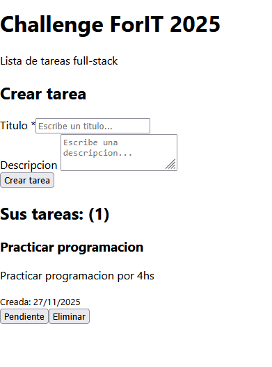
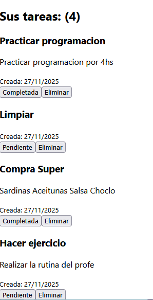

# 💻 Ingreso a Academia ForIT

# 📄 Descripcion 

    Es una aplicación fullstack simple para gestionar tareas, desarrollada como parte del Challenge de ingreso a Academia ForIT 2025.
    Incluye backend con Node.js + Express y frontend con React + Vite, cumpliendo con las funcionalidades CRUD completas.
    Esta app te permitira:
            ~Crear tareas
            ~Listar las tareas
            ~Marcar como completa/pendiente
            ~Borrarlas

## 🔎 Estructura de la Aplicacion 
    |-backend
    |    |-controllers
    |    |  |_ controller.js
    |    |
    |    |-routers
    |    |  |_tareasRouters.js
    |    |
    |    |-env.
    |    |-package-lock.json
    |    |-package.json
    |    |-server.js
    |
    |_frontend  
         |-src
         |   |-components
         |   |    |-TareaForm.jsx
         |   |    |-TareaItem.jsx
         |   |    |-TareaList.jsx
         |   |-App.jsx
         |   |-index.css
         |   |_main.jsx
         |
         |-.env

## 📷 Capturas de Pantalla

        📌 Pantalla principal
            

        📌 Listado de tareas
            

# 🖱 Instalación y Ejecución
    
    Clonar el repositorio
        
        git clone https://github.com/LourdesTorresRamonell/Ingreso-a-Academia-ForIT.git

## 🖥️ Backend
    
    1- Instalar dependencias
        cd backend
        npm install

    2- Ejecutar el servidor
        npm run dev

   📢 El backend corre en http://localhost:5000

## 🖥️ Frontend
    1- Instalar dependencias
        cd ../frontend
        npm install

    2- Iniciar el proyecto
        npm run dev

    📢Frontend disponible en http://localhost:5173

# 🔌 Endpoints del Backend
    Método	        Endpoint	        Descripción
    GET	            /tarea	            Listar tareas
    POST	        /tarea	            Crear nueva tarea
    PUT	            /tarea/:id	        Actualizar tarea
    DELETE     	    /tarea/:id	        Eliminar tarea

# 👤 Autora

    Lourdes Torres Ramonell
